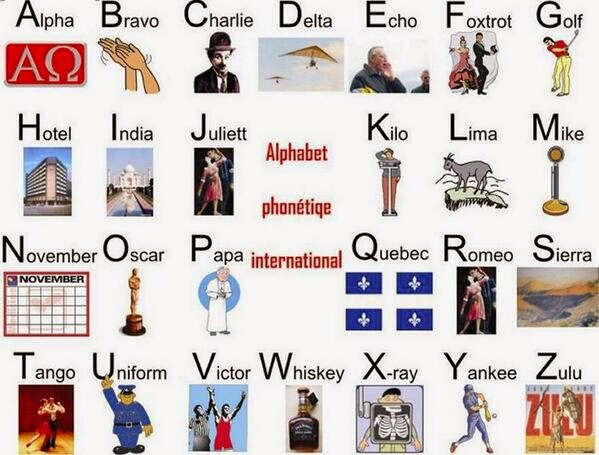

# Uluslararası
## Başlıksız 
- **ECC (Electronic Communication Community)** : Elektriksel Haberleşme Komitesi
- **Harec Belgesi** : A sınıfı Belge
- **IARU (International Amateur Radio Unity)**: Uluslararası Amatör Telsizciler Birliği
- Frekans tahsisine ihtiyaç duyulmayan, özel amaçlar için tahsis edilmiş frekans bandlarında ve çıkış gücünde çalışan, diğer sistemlerde elektromanyetik girişime sebep olmadan ve elektromanyetik girişime açık olarak kullanılan kurumca belirlenen teknik düzenlemelere uygun telsiz cihaz ve sistemlerinin herhangi bir telsiz kurma ve kullanma iznine ve telsiz ruhsatnamesine ihtiyaç göstermeksizin kurulması ve kullanılması ile ilgili usus ve esasları belirleyen yönetmelik **Özel Telsiz Sistemleri Yönetmeliği**'dir.
- Özel Telsiz Sistemleri yönetmeliğinin yayınlanması ile **Amatör Telsiz Yönetmeliği** yürürlülükten kaldırılmıştır.
- Aralarında fiziki bağlantı olmaksızın, elektromanyetik dalgalar yoluyla, açık, kodlu veya kriptolu ses ve veri almaya, vermeye veya yalnızca almaya ya da vermeye yarayan sistemlere **Telsiz Sistem** denir.
- Sınavda kopya çekenler **1 dönem sonra** sınava tekrar girebilir.
- **ERO (Europe Radio Office)** : Avrupa Radyo Haberleşme OfisiOfisi
- Aktarıcı veya Röle'lerin ön eki : **YM**
- Yürürlükteki yönetmeliğe göre, Amatör Telsizcilerin çağrı işaretinde kullanılan  bölge sayısı **10**.
- **AMPR** : Amatör Paket Radyo Sistemi
- 5809 sayılı Elektronik Haberleşme Kanunun 43. maddesi gereği Amatör Telsizcilik Sınavını yapma ve belge verme işlemleri **Kıyı Emniyeti Genel Müdürlüğü**'ne devredilmiştir. 
- Yasa ve yönetmeliklere uygun olarak sağlanan her türlü haberleşme hizmetini  engelleyen, haberleşmede kesinti doğuran veya kalitelerini bozan her türlü yayın veya elektromanyetik etkiye **Enterferans** denir.
- Amatör Telsizcilik sınavı **telsiz telefon ücret hesaplamasını** kapsamaz.
- 10450 - 10452 Mhz frekans band aralığını kullanma müsaadesi, **A ve B amatör telsizcilik belgesine** verilmiştir. 

---

## SWL Belgesi
- SWL, **3-30 Mhz** frekans bandı arasında ulusal ve uluslararası yayın yapan istasyonları dinleyen **kısa dalga dinleyicisi**. 
- Yürürlükteki yönetmeliğe göre, SWL belgesinin **süresi yoktur**.
- Yürürlükteki yönetmeliğe göre, SWL belgesi almak isteyenlere düzenlenecek olan çağrı işaretinde, bölge numarasından sonra **bulunduğu ilin tarfik kodu numarası** verilir.

---

## ITU
- **ITU (International Telecommunication Unity)** : açılımı Uluslararası Telekomünikasyon Birliği'dir.
- ITU Telsiz Regülasyon Kitabı'nın **25. bölümü amatör telsiz  düzenlemelerini** içerir.
- ITU'nun amacı **frekans tahsislerinin yönetiminde yardımcı olmak**.
- ITU **25. madde** Amatör Radyo Hizmeti ve Amatör Radyo Uydu Hizmetini kapsar.
- Türkiye, ITU’ ya göre **20. bölge** içinde yer almaktadır.

---

## CEPT 
- CEPT'in **T/R 61-01 tavsiye kararı**na göre CEPT ve CEPT üyesi olmayan ülkeler Amatör istasyonları **geçici olarak** kullanabilir. 
- CEPT ECC 89 raporu **giriş sınıfı sınav seviyesini** belirtir.
- CEPT’ e göre 3 çeşit Amatör Radyo Lisansı vardır. **Harec, Novice, Entring**
- CEPT’ in T/R 61- 01 tavsiyesine göre Amatör Telsizcilik Belgesine sahip olan yabancılar, ülkemizde 3 aydan az süre ile kaldıkları zaman kendi çağrı işaretini **kendi çağrı işareti önüne TA ve TB eklemelidir**.
- CEPT'in açılımı **Avrupa Posta ve Telekomünikasyon İdareleri Birliği**.

---

## Çağrı İşareti Bölümleri
- TA : Ön ek
- 3 : Bölge
- HPL : Son ek

---

## Amatör Telsiz
- Amatör Telsizcilik Belgesi belgenin düzenlendiği Ülkenin dilinde ve bunun yanında **Almanca**, **İngilizce** ve **Fransızca** dillerinde düzenlenmelidir.
- Amatör Telsizcilik Belgesi **anne adı** bilgisini gerektirmez.
- Amatör Radyo Planında **çağrı işareti** bulunmaz.
- Yürürlükteki yönetmeliğe göre, A sınıfı amatör telsizcilik belgesine sahip sorumlu operatörü bulunmak kaydıyla amatör telsiz istasyonu kuracak olan amatör telsiz dernekleri, eğitim ve öğretim kurumları, afet ve acil durum haberleşmesinde görev alan kuruluşlar, izcilik kuruluşları, araştırma kurumları ve benzerlerine **Organizasyon** denir.
- B sınıfı amatör telsizciler bir A sınıfı amatör telsizciye ait istasyonda ve nezaretinde **tüm amatör frekanslarda** çalışma yapabilirler.
- Türkiye ile mütekabiliyet anlaşması bulunan ülkelerden alınmış amatör telsizcilik  belgesine sahip olup, Türkiye’de üç aydan fazla faaliyette bulunmak isteyen amatör telsizcilere en çok bir yıla kadar verilen belgeye **Geçici amatör telsizcilik belgesi** denir.
- Amatör telsizcilik haberleşmesinde izin verilen çıkış gücü, emisyon, band genişliği ve frekansları gösteren plana **Amatör Radyo Band Planı** denir.
- Amatör telsiz haberleşmesi kayıtlarının tutulması amacıyla kullanılan deftere **haberleşme kayıt defteri** denir.
- Yürürlükteki yönetmeliğe göre, ikamet adresi değişen amatör telsizciler ile organizasyonlar yeni adreslerini **3 ay içinde** Kıyı Emniyeti Genel Müdürlüğüne bildirmek zorundadır.
 - Yürürlükteki yönetmeliğe göre sorumlu operatör organizasyonlar tarafından kurulan istasyonlardan sorumlu, **A sınıfı belgeye sahip amatör telsizcidir**.
 - Yürürlükteki yönetmeliğe göre, Amatör Telsizcilik Sınavına girme yaşı **12**'dir.
 - Yürürlükteki yönetmeliğe göre, A ve B sınıfı için oluşturulan 50 sorudan **en az 75 puan** alanlar A sınıfı Amatör Telsizcilik Belgesi almaya hak kazanır.
 - Amatör Telsiz istasyonunun frekansını, gücünü ve emisyonunu gösteren ulusal yönetmelik **Özel Telsiz Sistemleri Yönetmeliği**'dir.
 - Yürürlükteki yönetmeliğe göre, Amatör Telsizcilik Belgesi **Kamu Hizmetinden Yasaklananlar**a verilmez.
 - Yürürlükteki yönetmeliğe göre, Amatör Telsizcilik Belgesi almaya hak kazananlardan belge düzenlemesi sırasında **oturma belgesi** istenmez.
 - Yürürlükteki yönetmeliğe göre, Türkiye’de 3 aydan fazla geçici amatör telsizcilik faaliyetinde bulunacak olan yabancılardan belge düzenlemesi sırasında **vekâletname** istenmez.
 - Yürürlükteki yönetmeliğe göre, **yabancılara** geçici olarak tahsis edilen çağrı işaretinin süresi **oturma belgesinin süresi** kadardır.
 - Yürürlükteki yönetmeliğe göre, Amatör Telsizcilik Belgesinin süresinin dolması  halinde yenilenmesi sırasında T.C. vatandaşlarından **oturma belgesi** istenmez.
 - Yürürlükteki yönetmeliğe göre, Amatör Telsizcilik Haberleşmesinde **işletme kurallarına uyulması** yasaklanan uygulamalardan değildir.
 - Yürürlükteki yönetmeliğe göre, Amatör Telsizcilik sınavları yılda **en az 2 kez** yapılır.
 - Yürürlükteki yönetmeliğe göre, Amatör Telsizcilik Belgesi **10 yılda bir yenilenir**.
 - Yürürlükteki yönetmeliğe göre, **12 yaşından küçük** ve **kamu hizmetlerinden yasaklı** olanlar Amatör Telsizci olamazlar.

---

## Çağrı İşareti
- Yürürlükteki yönetmeliğe göre, **Amatör Telsiz Dernekleri** için verilen çağrı işaretinde son ekin ilk harfine **K harfi** verilir.
- Yürürlükteki yönetmeliğe göre, **B ve C sınıfı Amatör Telsizcilik Belgesi**ne sahip olanların çağrı işareti **TB** ile başlar.
- Yürürlükteki yönetmeliğe göre, Amatör Telsizcilere verilen çağrı işaretlerinde son ekin ilk harfinde **Q harfi kullanılamaz**.
- Yürürlükteki yönetmeliğe göre, **Afet ve Acil Durum haberleşmesi**nde görev alan  kuruluşlara verilen çağrı işaretinin **son ekin ilk harfi E'dir**.
- Yürürlükteki yönetmeliğe göre, **Amatör Telsizcilerin özel etkinliklerinde** kullanılmak üzere çağrı işareti **60 gün** tahsis edilir
- Yürürlükteki yönetmeliğe göre, Amatör Telsizcilik Belgesinin yenilenmemesi, organizasyonun feshi, tasfiyesi veya yetkilisinin müracaatı üzerine iptal edilmesi, bölge değişikliği gibi durumlarda çağrı işareti **10 yıl süre ile tahsis edilemez**.
- Yürürlükteki yönetmeliğe göre, Amatör Telsizcilik Haberleşmesinde Çağrı işareti  amatör telsizcinin **ölümü veya vesayet altına alınması** durumlarda iptal edilmez.
- YM1**K**ABC : Amatör Telsizcilik Derneği
- YM2**S**ABC : İzcilik Kuruluşu
- Erzincan’da deprem afeti sırasında kurulan bir istasyonda **TA9EQ**  işareti kullanılmaz.
- Geçici olarak Almanya’dan ülkemize gelen ve Antalya’da telsiz haberleşmesi yapmak isteyen DL5YCQ çağrı işaretli A sınıfı bir amatör telsizci, haberleşmesinde **TA4/DL5YCQ çağrı** işaretini kullanır.
- ITU tarafından Türkiye’ye tahsis edilmiş ve amatör telsiz haberleşmesinde kullanılan  çağrı işareti ön ekleri **YM, TA, TB ve TC'dir**.

---  
---  
---  

# İşletme
## Başlıksız
- Amatör Telsizcilerin belirli zamanlarda yaptıkları yarışmaların **(CONTEST)** amacı en kısa zamanda mümkün olduğunca çok QSO yapmak.
- Repeater / Röle istasyonları direkt haberleşme yapan istasyonların haberleşmesi için yapılır.
- Bir telsiz operatörü CW modunda karşısındakinin alma becerisine göre gönderir.
- Telsiz telefon görüşmelerinde tehlike anında yapılan çağrı **mayday**'dir.
- Uluslararası amatör radyo görüşmelerinde UTC saat sistemi kullanılır.
- Simplex çalışma sisteminde aynı anda tek frekans kullanılır ve haberleşme tek yönlüdür.
- 5000 mil uzaktaki bir istasyonla görüşmeden önce anten yönünü ayarlamak için **Azimut Haritası**'na bakılır.
- Veri çıkışı test kontrolleri sırasında **Suni Anten (Dummy Load)** kullanılır.
- Radyo sinyallerinin yayılmasında kullanılan kritik açı belirli iyonosfer şartlarında bir radyo dalgasının dünyaya dönen en yüksek açısıdır.
- Bir istasyon ilk açıldığında yapılması gereken ilk şey Çalışılacak bandda kısa bir süre dinleme yaparak haberleşme koşullarınınuygun olup olmadığını tespit etmek ve bandda çalıĢşan istasyon bulunup bulunmadığına bakmaktır.
- Amatör telsizciler **Uluslararası Mors Kodu**'nu kullanır.
- S metre sinyal seviyesini ölçer.
- Bir elektromanyetik dalganın polarizasyonu, verici anteninin toprağa göre açısına bağlıdır.
- İstenmeyen radyasyonların ayarlanmış antenlerden yayılmasını engellemek için filtre veya zayıflatıcı kullanmalıyız.
- 435 MHz'de bir yagi anten, UHF TV antenine doğru çevrilmiştir. Bunun sonucunda RF giriş katında aşırı yükleme olur.
- Enterferansa neden olan sinyaller TV anteni kablosunun ekranı veya ekran kartı ile TV'ye ulaşır. Bundan kaçınmak için TV anteninden olabildiğince uzak olmak gerekir.
- Başka bir istasyonla konuşurken bir acil durum çağrısı duyarsanız konuşmayı bırakıp açil çağrıya cevap vermeniz gerekir.
- CQ DX CQ DX CQ DX de TA3HPL TA3HPL TA3HPL uzak mesafe istasyonlara genel bir çağrıdır.
- CQ contest CQ contest this is TA3HPL gibi bir çağrı  TA3HPL yarışma istasyonlarına genel bir çağrı yapıyor demektir.
- İki istasyon arası test mesajlarının başına ve sonuna test kelimesi konulmalıdır.
- Amatör telsizciler şifreli haberleşme yapamazlar.
- Bİr alıcı-verici'deki susturma kontrolü hiçbir sinyal alınmadığında gürültüyü kesmek içindir.
- Paket data gönderen amatör telsiz istasyonunda mikrofon kullanılmaz.
- Amatör telsizciliğin 5 amacından 2'si Eğitimli telsiz operatörleri ile elektronik uzmanlarının sayısını artırmak ve uluslararası saygınlığı geliştirmek.
- Amatör telsizler iş yürütmek için kullanılamazlar.
- Pilotun onayı ile uçağın teçhizatını kullanmadan uçakta telsiz çalıştırabilirsiniz.
- Gönderilecek frekansı seçerken o frekansın boş olup olmadığını anlamak için dinlemek gerekir.
- Herhangi bir istasyon ile görüşme yapmak için aradığınızı "kendi çağrı işaretinizi takiben CQ" yaparak belli edebilirsiniz. Buna cevap verirken ise diğer istasyonun çağrı işaretini takiben kendi çağrı işaretinizi söylemeniz gerekir.
- Bir frekansta iki istasyonun konuşmasını kesmek için konuşma arasında kendi çağrı işaretinizi söylemeniz gerekir.
## Ülkelerin Çağrı işaretleri
- **DL (Deutschland)** : Almanya 
- **VX** : Avustralya
- **ON** : Belçika
- **PY** : Brezilya
- **LA** : Norveç
- **EA** : İspanya
## Türkiye Çağrı İşareti Bölgeleri

- TA2EX/3 : 2. bölgeden 3. bölgeye geçen bir amatör telsizci

---

## RST Raporu
**RST Raporu** konuşmanın anlaşılmasını 5 üzerinden puanlamaktır.
1 : Anlaşılmıyor
2 : Çok zor anlaşılıyor
3 : Zor anlaşılıyor
4 : Zorluk çekilmeden anlaşılıyor
5 : Mükemmel anlaşılıyor

---

## Sinyal Seviyesi,
s metre ile ölçülür.
1 : Soluk sinyaller
2 : Çok zayıf sinyaller
3 : Zayıf sinyaller
4 : Adil sinyaller
5 : Oldukça iyi sinyaller
6 : İyi sinyaller
7 : Orta derece güçlü sinyaller
8 : Güçlü sinyaller
9 : Son derece güçlü sinyaller

---

## En Çok Kullanılan Q Kodları
Q Kodları hem soru hem cevap olarak kullanabilir.
- **QRA** : Çağrı işaretiniz nedir?
- **QTR** : Bulunduğunuz bölgede saat kaçtır?
- **QRV** : Hazır mısınız? Frekansta göndermeye başlamadan önce kullanılır genellikle.
- **QRX** : Ne zaman tekrar arayacaksınız?
- **QSK** : Beni duyabiliyor musunuz?
- **QTH** : İstasyonunuzun tam olarak yeri neresidir?
- **QSY** : Frekansı değiştireyim mi?
- **QRL** : Meşgul müsün?
- **QRT** : Göndermeyi durdurayım mı?
- **QRZ** : Beni kim çağırıyor?
- **QSV** : Bir dizi V harfi göndereyim mi?
- **QRM** : Diğer istasyonlardan parazit alıyor musun?

## En Çok Kullanılan 92 Kodları
- 73 : Selamlar

---

## Mors Alfabesi

---

## Uluslararası Fonetik Alfabe

---

## Kısaltmalar
- **CW (Continues Wave)** : Devamlı Dalga
- **AR** : Yayın sonu
- **CQ** : Bütün istasyonlara genel çağrı yapmak için kullanılır. Daima CW kullanılmalıdır.
- **CL** : İstasyonumu kapatıyorum
- **RTTY** : Radyo Teletype
- **IF (Inter-Frequency)** : ara frekans 
- **MSA** : Ulusal saat
- **BCI** : Radyo Yayın Entertferansı
- **LZ** : Bulgaristan
- **CFM** : Tasdik etmek
- **TX** : (Transmitter)Verici
- **RX** : (Receiver)Alıcı
- **PSK** : Faz Kaydırmalı Anahtarlama

---

## Terimler 
- **Pile up(yığılma)** : Çağrı yapan bir amatörün o frekanstaki diğer amatörler tarafından QSO yağmuruna tutulması.
- **Broadcast** : Tek yönlü radyo yayınıdır.
- **QSL Kartı** : Yapılan bir görüşme sonunda (QSO) görüşmeyi onaylamak için kullanılır.
- **Uplink** : Yerden uyduya çıkış frekansı
- **PEP** : Azami Çıkış Gücü
- **BX** : Devam etmekte olan yayını kesmek için kullanılan kod.
- **A1A** : Genlik Modülasyonlu, çift kenar band modüle edici alt taiıyıcı kullanmayan, sayısal bilgi ihtiva eden tek kanallı açık-kapalı Şeklinde anahtarlama sistemi ile çalışan telgraf yayını.
- **J3E** : Genlik Modülasyonlu, tek kenar band, taşıyıcısı bastırılmış, analog bilgi ihtiva eden, tek kanallı telefon yayını.

---

## Frekans - Band Soruları
!!!Haberleşme çeşitleri yazılacak!!!
- IARU Region 1 düzenlemesine göre 144.010 mHz'de FM yayını yapılamaz.
- 144.0 - 144.1 mHz'de sadece CW yayını yapılabilir.
- 14250 kHz'de SSB haberleşmesi yapılabilir.
- VHF bandında haberleşme direkt dalgalar ile yapılır.
- Crossband, ayrı bandlarda almak ve göndermek demektir.
- 1810 - 1850 kHz, sadece A sınıfı amatörler içindir. Çıkış gücü 9W olmalıdır.
- 14 mHz bandını A sınıfı amatöler tek başına kullanabilir.
- 10100 - 10150 kHz arası maximum çıkış gücü 75 Watt'tır.
- 50 - 50.1 arasında yalnızca CW kullanılabilir.
## IARU Region-1 Bands
### LF (Low Frequency)
- **2200 meters band** : 135.7–137.8 kHz

### MF (Medium Frequency)
- **630 meters band** : 472–479 kHz
- **160 meters band** : 1800–2000 kHz (1.8-2 MHz)

### HF (High Frequency)
- **80 meters band** : 3.5–4.0 MHz (3500–4000 kHz)
- **60 metre bandı** : 5 MHz'te olanlar.
- **40 metre bandı** : 7 - 7.3 MHz
- **30 metre bandı** : 10.1 - 10.15 MHz
- **20 metre bandı** : 14 - 14.35 MHz
- **10 metre bandı** : 28–29.7 MHz

### VHF (Very High Frequency)
- **6 meters** – 50–54 MHz
- **4 metre** – 70–70.5 MHz
- **2 metre** – 144–148 MHz
- **1.25 metre** – 219–220 MHz (Canada only), 222–225 MHz (US & Canada)

### UHF (Ultra High Frequency)
- **70 santimetre** – 420–450 MHz
- **33 santimetre** – 902–928 MHz
- **23 santimetre** – 1240–1300 MHz (1240–1325 MHz in UK)
- **13 santimetre** – 2300–2310 MHz (alt segment), 2390–2450 MHz (üst segment)

### Frekans - Band Hesaplaması
frekans(Hz) * dalga boyu(m) = ışık hızı (300000000m/s)
145675000 Hz * dalga boyu = 300000000 m/s
dalga boyu = 300000000/145675000
dalga boyu = 2.05937875408
145.675.000 frekansı 2 metre bandındadır.

[for more](https://en.m.wikipedia.org/wiki/Amateur_radio_frequency_allocations)

---

## Herhangi bir istasyon ile bağlantı kurulunca
- Her bağlantı sonu çağrı işareti tekrarlanır.
- Simplex bir kanal ise ve uzun süre görüşülecek ise başka kanala geçilir.
- Cümleler kısa, net ve anlaşılır tutulur.

## Transmisyon Hattı Çeşitleri
- Tek Telli Hatlar
- İki Telli Paralel Hatlar
- Koaksiyel Hatlar
 
 ---
 
 ## Türkçe Fonetik Alfabe
 - A : Ankara
 - B : Bursa
 - C : Ceyhan
 - Ç : Çankırı
 - D : Denizli
 - E : Edirne
 - F : Fatsa
 - G : Giresun
 - H : Hopa
 - I : Isaparta
 - İ : İzmir
 - J : Jale
 - K : Kayseri
 - L : Lüleburgaz
 - M : Manisa
 - N : Nazilli
 - O : Ordu
 - Ö : Ödemiş
 - P : Pazar
 - R : Rize
 - S : Samsun
 - Ş : Şarköy
 - T : Trabzon
 - U : Urfa
 - Ü : Ünye
 - V : Van
 - Y : Yalova
 - Z : Zonguldak

---

## Uluslararası Fonetik Alfabe
- A : Alpha
- B : Bravo
- C : Charlie
- D : Delta
- E : Echo
- F : Foxtrot
- G : Golf
- H : Hotel
- I : India
- J : Juliet
- K : Kilo
- L : Lima
- M : Mike
- N : November
- O : Oscar
- P : Papa
- Q : Quebec
- R : Romeo
- S : Sierra
- T : Tango
- U : Uniform
- V : Victor
- W : Whiskey
- X : X-Ray
- Y : Yankee
- Z : Zulu
# son soru 50
